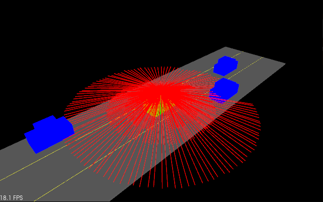
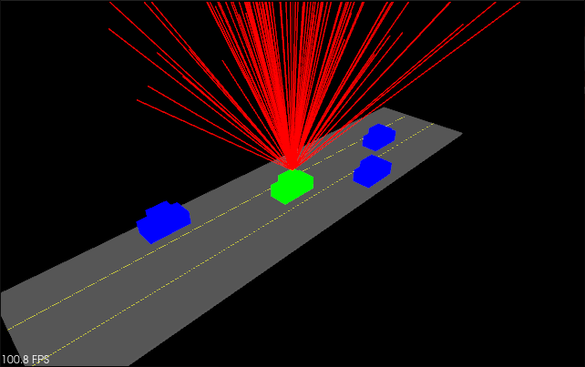

# The results of different simulations are as follows: 

<table>
  <tr>
  <td align="center"><b>Fig 2.1</b>: LIDAR intialized with 0 horizontal param</td>
  <td align="center"><b>Fig 2.2</b>: LIDAR intialized with high horizontal param</td>
  
  <tr>
  </tr>
  <tr>
    <td align="center"></td>
    <td align="center"></td>
   
  </tr>
</table>

<table>
  <tr>
  <td align="center"><b>Fig 3.1</b>: LIDAR with more layers</td>
  <td align="center"><b>Fig 3.2</b>: LIDAR with higher radial</td>
  <td align="center"><b>Fig 3.3</b>: LIDAR with more Error</td>
  
  <tr>
  </tr>
  <tr>
    <td align="center"></td>
    <td align="center"></td>
    <td align="center"></td>
   
  </tr>
</table>

